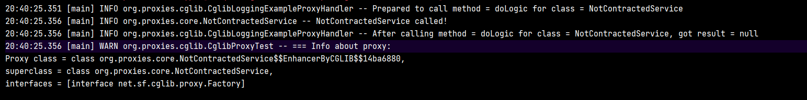
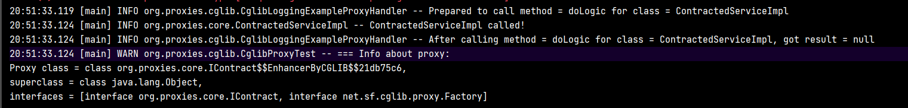

Является подключаемой библиотекой, пример депенденси:
```xml
<dependency>  
    <groupId>cglib</groupId>  
    <artifactId>cglib</artifactId>  
    <version>3.3.0</version>  
</dependency>
```

Принцип такой же, как и у JDK dynamic proxy:
>Под прокси подразумевается мимикрирующий под целевой класс перехватчик обращений, который передаст вызов нашему хендлеру, который  оборачиваем вызов целевого класса своей логикой. 
>
> Хендлер обмазан рефлексией поэтому универсален для любых оборачиваемых классов.

Важное различие в том, что cglib умеет как проксировать по интерфейсу, так и проксировать классы без интерфейсов через наследование.
# Ограничение
При JDK >= 17 версии из-за системы модулей у cglib начинаются проблемы: https://github.com/cglib/cglib/issues/191,  
нужно добавить в JVM OPTS:  
```bash
--add-exports=java.naming/com.sun.jndi.ldap=ALL-UNNAMED  
--add-opens=java.base/java.lang=ALL-UNNAMED  
--add-opens=java.base/java.lang.invoke=ALL-UNNAMED  
--add-opens=java.base/java.io=ALL-UNNAMED  
--add-opens=java.base/java.security=ALL-UNNAMED  
--add-opens=java.base/java.util=ALL-UNNAMED  
--add-opens=java.management/javax.management=ALL-UNNAMED  
--add-opens=java.naming/javax.naming=ALL-UNNAMED
```

В противном случае, при использовании будет примерно такая ошибка, связанная с системой модулей, которую активно продвигают в более новых JDK:
```java
java.lang.reflect.InaccessibleObjectException-->Unable to make protected final java.lang.Class java.lang.ClassLoader.defineClass(java.lang.String,byte[],int,int,java.security.ProtectionDomain) throws java.lang.ClassFormatError accessible: module java.base does not "opens java.lang" to unnamed module @2e5c649
```

Альтернативным решением проблемы может быть использование Spring, так как у него своя реализация cglib функционала без проблем оригинала. Об этом в разделе чуть ниже, где будет про спринг.
# Пример создания прокси
```java
public class CglibProxyFactory {  
  
    public static NotContractedService getProxyForNotContracted(NotContractedService proxyTarget) {  
        CglibLoggingExampleProxyHandler callback = new CglibLoggingExampleProxyHandler(proxyTarget);  
  
        Enhancer enhancer = new Enhancer();  
        enhancer.setSuperclass(proxyTarget.getClass());  
        enhancer.setCallback(callback);  
  
        return (NotContractedService) enhancer.create();  
    }  
  
    public static IContract getProxyForContracted(IContract proxyTarget) {  
        CglibLoggingExampleProxyHandler callback = new CglibLoggingExampleProxyHandler(proxyTarget);  
  
        Enhancer enhancer = new Enhancer();  
        enhancer.setInterfaces(proxyTarget.getClass().getInterfaces());  
        enhancer.setCallback(callback);  
  
        return (IContract) enhancer.create();  
    }
```
Прокси создается через класс `net.sf.cglib.proxy.Enhancer`, в котором можно задать:
- setSuperClass - тип проксируемого класса, в этом случае будет проксирование через наследование
- setInterfaces - интерфейсы проксируемого класса, в этом случае проксирование будет подобно jdk dynamic proxy - через имплементацию контрактов
- setCallback - это хендлер, который добавляет логику и вызывает целевой класс.

Сам колбек это реализация контракта `net.sf.cglib.proxy.MethodInterceptor`:
```java
@Slf4j  
@RequiredArgsConstructor  
public class CglibLoggingExampleProxyHandler implements MethodInterceptor {  
  
    private final Object proxiedClass;  
  
    @Override  
    public Object intercept(Object o, Method method, Object[] args, MethodProxy methodProxy) throws Throwable {  
  
        log.info("Prepared to call method = {} for class = {}",  
                method.getName(),  
                proxiedClass.getClass().getSimpleName()  
        );  
  
        Object result = method.invoke(proxiedClass, args);  
  
        log.info("After calling method = {} for class = {}, got result = {}",  
                method.getName(),  
                proxiedClass.getClass().getSimpleName(),  
                result  
        );  
  
        return result;  
    }  
}
```
Он очень похож на тот, что у JDK.
# Тесты и что там под капотом
Сделаем тест, который создает прокси, вызывает метод и выводит что там в супертипах и интерфейсах.

**Тест класса без интерфейса**:

- cglib так же, как и jdk создает динамический класс, но если в JDK он называется `$Proxy`, то у cglib он имеет более говорящее имя в формате: `ИмяПроксируемогоКласса$$EnhancerByCGLIB$$`.
- Также, в данном случае, т.к. нет интерфейса, прокси перехватчик был создан через наследование, поэтому в `superClass` указан наш проксируемый класс.
- В интерфейсах виден служебный для cglib интерфейс `Factory`. Это абстракция для всех динамических классов, создаваемых через `Enhancer`.

Проксируемый класс: 
```java
@Slf4j  
public class NotContractedService {  
    public void doLogic() {  
        log.info("{} called!", this.getClass().getSimpleName());  
    }  
}
```

**Тест класса с интерфейсом**:
Также, cglib способен работать подобно jdk Proxy, реализовывая интерфейс, в этом случае классу Enhancer нужно указать интерфейсы, которые динамически созданный класс должен будет реализовать.



- Видим всё ту же приписку у прокси - `$$EnhancerByCGLIB$$`
- В суперклассах теперь Object, как и у всех - т.е. прокся создана не через наследование.
- В интерфейсах - `interface org.proxies.core.IContract, interface net.sf.cglib.proxy.Factory`, т.е. тот, который реализует проксируемый класс и служебный cglib.

Проксируемый класс:
```java
@Slf4j  
public class ContractedServiceImpl implements IContract {  
  
    @Override  
    public void doLogic() {  
        log.info("{} called!", this.getClass().getSimpleName());  
    }  
}
```

