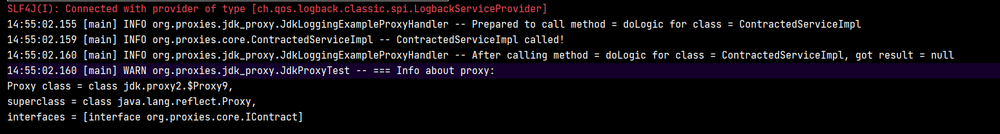

Встроенный в java способ создания прокси.

Под прокси подразумевается мимикрирующий под целевой класс перехватчик обращений, который передаст вызов нашему хендлеру, который  оборачиваем вызов целевого класса своей логикой. 

Хендлер обмазан рефлексией поэтому универсален для любых оборачиваемых классов.
# Ограничение
Важное ограничение: 
>запроксировать можно только интерфейсы - т.е. если класс не реализует ни одного интерфейса, прокси для него создать не получится. Всё дело в том, что JDK dynamic прокси создает класс, реализующий те же интерфейсы, что и целевой, из-за чего может притворяться им.

Если нужно запроксировать класс, не реализующий ни одного интерфейса - нужно использовать cglib.
# Пример создания прокси
```java
public class JdkProxyFactory {  
  
    public static IContract getProxyForContracted(IContract proxyTarget) {  
        JdkLoggingExampleProxyHandler callback = new JdkLoggingExampleProxyHandler(proxyTarget);  
  
        Object proxy = Proxy.newProxyInstance(  
                JdkProxyFactory.class.getClassLoader(),  
                proxyTarget.getClass().getInterfaces(),  
                callback  
        );  
  
        return (IContract) proxy;  
    }  
}
```
Используется статический метод класса Proxy, он динамически создаст класс, который реализует предоставленные интерфейсы и будет триггерить при вызове переданный колбек.

Сам колбек это реализация контракта `java.lang.reflect.InvocationHandler`:
```java
@Slf4j  
@RequiredArgsConstructor  
public class JdkLoggingExampleProxyHandler implements InvocationHandler {  
  
    private final Object proxiedClass;  
  
    @Override  
    public Object invoke(Object proxy, Method method, Object[] args) throws Throwable {  
        log.info("Prepared to call method = {} for class = {}",  
                method.getName(),  
                proxiedClass.getClass().getSimpleName()  
        );  
  
        Object result = method.invoke(proxiedClass, args);  
  
        log.info("After calling method = {} for class = {}, got result = {}",  
                method.getName(),  
                proxiedClass.getClass().getSimpleName(),  
                result  
        );  
  
        return result;  
    }  
}
```
# Тесты и что там под капотом
Сделаем тест, который создает прокси, вызывает метод и выводит что там в супертипах и интерфейсах. Получим следующие логи:

- В логе мы видим, что на самом деле прокси имеет тип `$Proxy` - это динамически созданный класс.
- Он наследуется от `Proxy` - тот, через который мы создавали проксю.
- И он имплементирует интерфейс `IContact` (это наш прикладной класс), который интерфейс проксируемого `ContractedServiceImpl`:

```java
@Slf4j  
public class ContractedServiceImpl implements IContract {  
  
    @Override  
    public void doLogic() {  
        log.info("{} called!", this.getClass().getSimpleName());  
    }  
}
```