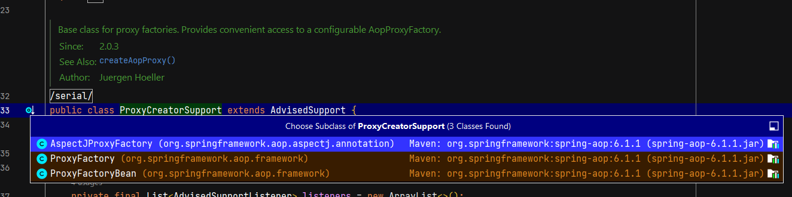

Spring оборачивает cglib и Jdk dynamic proxy в свои обёртки, как бы расширяя их функционал под свои нужды. 

Но есть нюанс с cglib: они не используют библиотеку, а сделали свой (перенесли или что-то такое), из-за чего нет проблем с модулями в JDK >= 17 и всё работает без доп. пропертей для JVM.

# Немного внутренностей

Тяжело говорить про общее и по отдельности как-то обособленно, поэтому будет всё вместе.

## Что где лежит и почему

CGLIB располагается непосредственно в `spring-core` зависимости, т.е. является частью основного функционала спринга. 
Для примера, у них свой Enhancer и всё, что было у зависимости cglib.
`org.springframework.cglib.proxy.Enhancer`

Неприятно, что для этого придется тянуть и кор спринга, но оригинальный cglib менее устойчив на новых jdk. Но если используешь уже спринг, то приятный подарок.

Основные хелперы по созданию проксей лежат в артефакте `spring-aop`.
Итого, для минимального старта проксирования средствами спринга нужно две зависимости:

```xml
<dependency>  
    <groupId>org.springframework</groupId>  
    <artifactId>spring-core</artifactId>  
    <version>6.2.0</version>  
    
</dependency>  
<dependency>  
    <groupId>org.springframework</groupId>  
    <artifactId>spring-aop</artifactId>  
    <version>6.1.1</version>  
</dependency>
```

Ну или можно какой-то стартер затянуть, но там ещё миллион всего будет.
## Что нам дает spring-aop

Начнём с верхнего уровня, это:
- `org.springframework.aop.framework.ProxyFactory` - фактори, объединяющая создание проксей разными способами в себе.
- `org.springframework.aop.support.AopUtils` - утилитный класс с полезными методами, например, позволяет достать из прокси тип проксируемого класса (с учетом того, что он может быть как через имплементацию, так и через наследование), узнать, какой тип прокси: cglib или jdk dynamic proxy.

>[!warning]
>`AopUtils` умеет работать только с проксями, созданными спрингом, т.к. он дообогащает их контракты, они имеют дополнительные контракты-маркеры. Если применить класс на созданные обычным cglib (не спринговым) или jdk proxy - он распознать не сможет и будет работать некорректно.

На самом деле, у ProxyFactory есть параллельные классы от общего родителя, но они мало применимы в отрывае от внутренних механизмов спринга: 


И все они сходятся в использование данного метода:


Изначально доступна только одна AopProxyFactory, она создает прокси через cglib, либо jdk по своему усмотрению, коммент + алгоритм создания:


В итоге мы подходим к ещё важным классам:
- `org.springframework.aop.framework.AopProxy` - контракт для классов, создающих прокси, по умолчанию только 2 реализации: cglib и jdk
- `org.springframework.aop.framework.CglibAopProxy` - использует `Enhancer` из `spring-core`, чтобы создать cglib проксю.
- `org.springframework.aop.framework.ObjenesisCglibAopProxy` - расширение `CglibAopProxy`, умеющее создавать инстансы без применения конструктором или что-то такое, см `org/springframework/objenesis/Objenesis.java` в `spring-core`.
- `org.springframework.aop.framework.JdkDynamicAopProxy` - использует Proxy класс JDK для создания проксей.

В общем тут есть над чем подумать.

## Отличие проксей, созданных спрингом

Прокси, которые создает средствами spring-aop, будь они через jdk или spring cglib, реализуют дополнительный контракт:


Но на самом деле у AOP-проксей будет контракт пошире - наследник этого:


# Пример использования

**Создадим прокси от класса без интерфейса**


Само создание прокси +- как у JDK и cglib:
- мы передаем в Factory класс, он там посмотрит, есть ли интерфейсы и решит, как ему больше нравится создать класс.
- в advice передаем хендлер - класс, который реализует доп.логику.

Сам класс:
```java
@Slf4j  
public class NotContractedService {  
    public void doLogic() {  
        log.info("{} called!", this.getClass().getSimpleName());  
    }  
}
```

Хедлер реализует контракт `org.aopalliance.intercept.MethodInterceptor`, отличие от cglib и jdk хендлеров лишь в том, что рефлексийна информация завернута в объект `MethodInvocation`.
```java
@Slf4j  
@RequiredArgsConstructor  
public class SpringLoggingExampleProxyHandler implements MethodInterceptor {  
  
    private final Object proxiedClass;  
  
    @Override  
    public Object invoke(MethodInvocation invocation) throws Throwable {  
  
        Method method = invocation.getMethod();  
        Object[] args = invocation.getArguments();  
  
        log.info("Prepared to call method = {} for class = {}",  
                method.getName(),  
                proxiedClass.getClass().getSimpleName()  
        );  
  
        Object result = method.invoke(proxiedClass, args);  
  
        log.info("After calling method = {} for class = {}, got result = {}",  
                method.getName(),  
                proxiedClass.getClass().getSimpleName(),  
                result  
        );  
  
        return result;  
    }  
}
```

Лог выведет нам информацию:


По логу видим:
- Был использован cglib - появился суффикс `$$SpringCGLIB$$`
- Отнаследован от проксируемого класса
- Реализует 3 интерфейса: 
	- `interface org.springframework.aop.SpringProxy` - маркерный, используется, чтобы определить, что прокси была создана спрингом.
	- `interface org.springframework.aop.framework.Advised` -  более функциональный, позволяет получать метаинформацию из прокси.
	- `interface org.springframework.cglib.proxy.Factory]` - аналог cglib Factory, только в спринге.

**Создадим прокси от класса с интерфейсом интерфейса**

Создание ровно такое, как и у класса без интерфейса.

Проксируемый класс:
```java
@Slf4j  
public class ContractedServiceImpl implements IContract {  
  
    @Override  
    public void doLogic() {  
        log.info("{} called!", this.getClass().getSimpleName());  
    }  
}
```

Посмотрим на метаинформацию:


- Прокси была создана через JDK, что видно по имени класса - `jdk.proxy2.$Proxy9`, и классу-родителю - `java.lang.reflect.Proxy`, т.е. прокси имплементирует те же интерфейсы, что и проксируемый класс.
- В интерфейсах видим уже 4 штуки: 
	- `interface org.proxies.core.IContract` - контракт проксируемого класса.
	- `interface org.springframework.aop.SpringProxy` - маркерный, используется, чтобы определить, что прокси была создана спрингом.
	- `interface org.springframework.aop.framework.Advised` -  более функциональный, позволяет получать метаинформацию из прокси.
	- `interface org.springframework.core.DecoratingProxy` - не очень понял, но что-то, что создано чем-то вне иерархии спринга, возможно из-за того, что использовался функционал JDK.
