# Вложенные транзакции и их взаимооткат

# Словарик перед стартом

Под внешней транзакцией подразумевается самое раннее по стеку навешивание на метод Transactional аннотации.

Под вложенной транзакцией подразумевается более позднее по стеку использование Transactional, которое по алгоритму вызывается после открытия внешней транзакции.
# Если вложенная транзакция с propagation по умолчанию (REQUIRED) выбросит исключение, откатится ли внешняя?

Да, вызов rollback у вложенной транзакции с пропагацией по умолчанию отравляет внешнюю транзакцию.

Смоделируем пример, как всё будет:
1. есть `ServiceA` и `ServiceB`, их публичные методы отмечены `Transactional` (или через TransactionTemplate открывают сами, тут без разницы).
2. `ServiceB` завершает свою логику с ошибкой (неважно, база кидает или он сам в коде, т.к. не понравился результата из базы).
3. В результате, аспект транзакционности спринга вызывает метод `rollback` у вложенной транзакции, пробрасывая исключение наверх
4. `ServiceA` ловит его обрабатывает, что-то делает дальше.
5. В какой то момент он попытается закоммитить транзакцию, однако `ServiceB` своим ролбеком установил флаг `rollbackOnly` на состояние внешней транзакции, таким образом, отправив его. По итогу при попытке коммита срабатывает `rollback`, причём ServiceA ещё и выбросит `UnexpectedRollbackException`

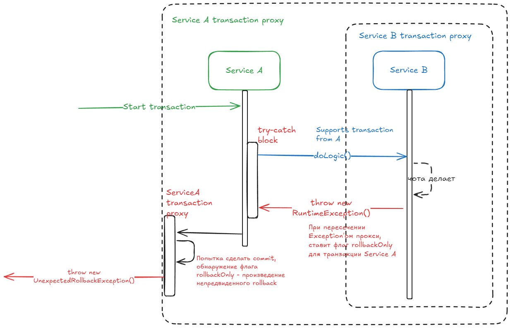
# Но как насчёт REQUIRED_NEW
Добавим к цепочке ServiceA и ServiceB ещё и ServiceC, который ServiceA вызывает сразу после обработки исключения от ServiceB. Он закоммитится успешно, несмотря на rollback ServiceA, т.к. тип пропагации REQUIRED_NEW создает отдельную транзакцию со своим независимым состоянием.
# Итоговый пример

Допустим, есть сервис A, B, C, D. Все транзакционные. B, C, D вызываются из A, при этом, B кидает исключение, которое отлавливает и подаваляет А. C имеет тип пропагации REQUIRED_NEW.

Тогда получим следующее поведение:
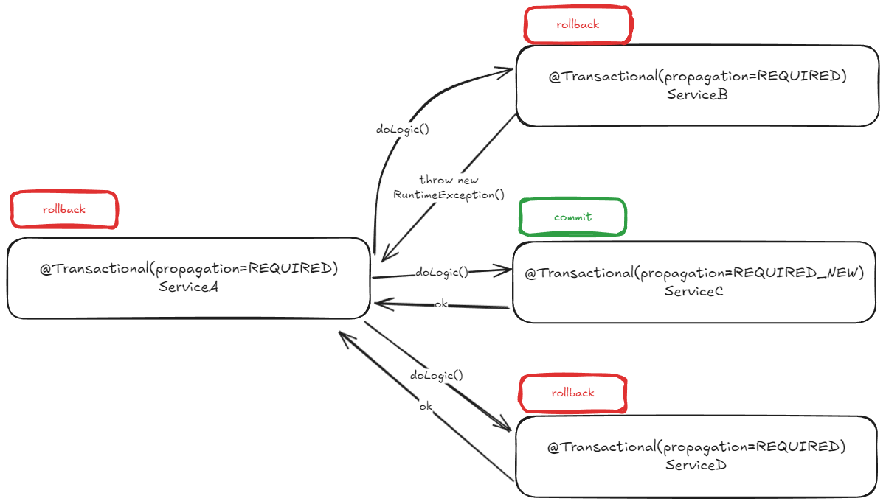)
- B отправляет транзакционное состояние А.
- Из-за этого откатывается A, B, D (этот, т.к. также поддерживает транзакцию A и зависит от неё, должен бы закоммититься вместе с A, но ушёл в rollback).
- C успешно коммитится, т.к. REQUIRED_NEW пропагация создает новую транзакцию со своим собственным состоянием.

Немного копаем вглубь процессов

## Аспект транзакции

По логу, который выводится при откате, можно понять, где происходят процессы:
```java
org.springframework.transaction.UnexpectedRollbackException: Transaction rolled back because it has been marked as rollback-only
	at org.springframework.transaction.support.AbstractPlatformTransactionManager.processRollback(AbstractPlatformTransactionManager.java:938) ~[spring-tx-6.1.14.jar:6.1.14]
	at org.springframework.transaction.support.AbstractPlatformTransactionManager.commit(AbstractPlatformTransactionManager.java:754) ~[spring-tx-6.1.14.jar:6.1.14]
	at org.springframework.transaction.interceptor.TransactionAspectSupport.commitTransactionAfterReturning(TransactionAspectSupport.java:663) ~[spring-tx-6.1.14.jar:6.1.14]
	at org.springframework.transaction.interceptor.TransactionAspectSupport.invokeWithinTransaction(TransactionAspectSupport.java:413) ~[spring-tx-6.1.14.jar:6.1.14]
```

Вся магия происходит в `TransactionAspectSupport.invokeWithinTransaction`. Он оборачивает транзакцией логику, вызывает и обрабатывает результат.
- Если попадается исключение, дергается метод `completeTransactionAfterThrowing`
- Если успешно - `commitTransactionAfterReturning`

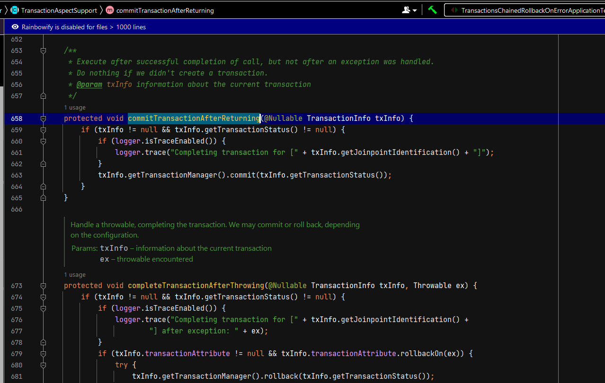

При успешном сценарии дергается `transactionManager.commit`:
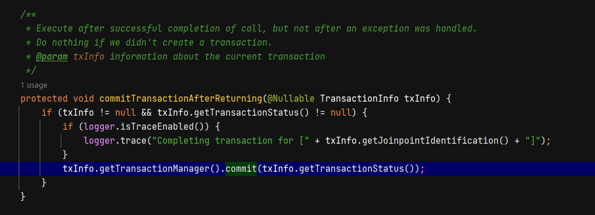

При отлове ошибки логика хитрее: мы можем указать, что определенные типы ошибок нужно игнорировать, тогда будет commit, но если полученное исключение не находится в белом списке, тогда вызывается `transactionManager.rollback`:
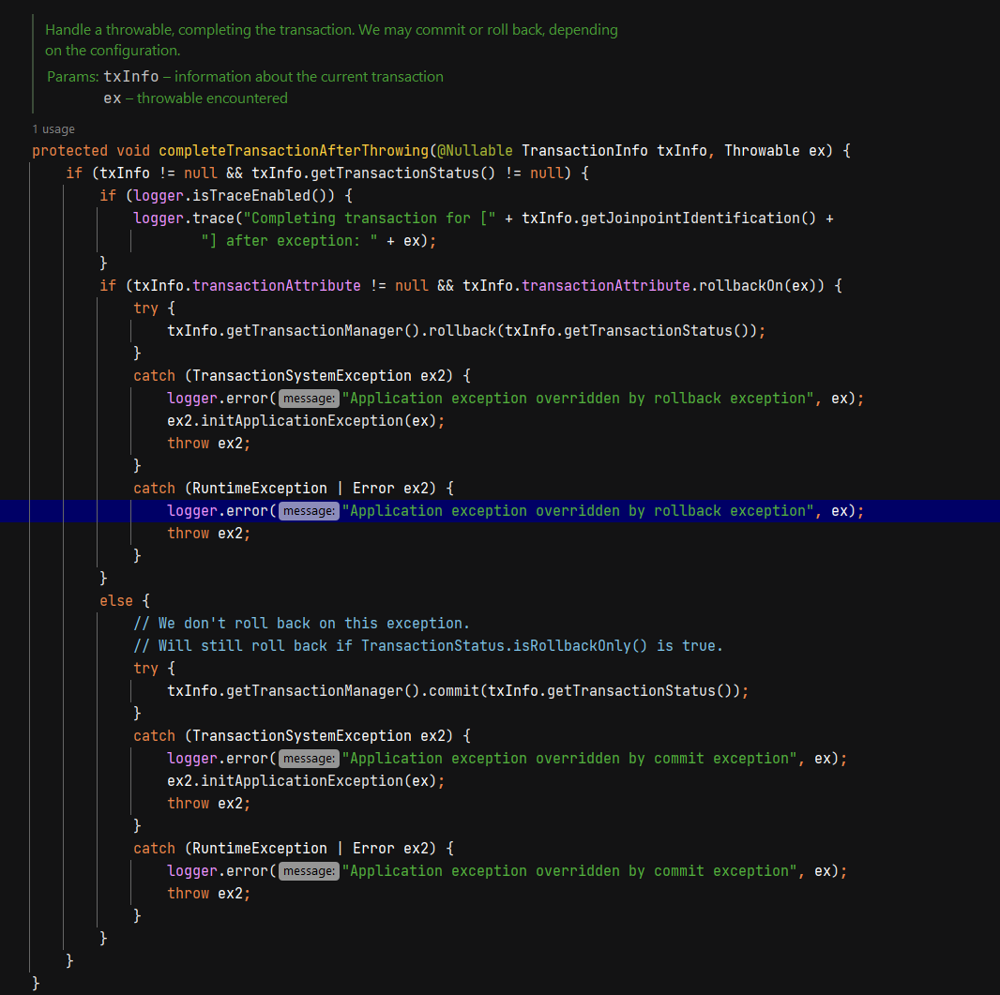

Более того, список исключений для игнорирования получается из такого вот вызова:
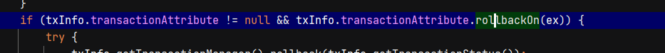

В случае дефолтного поведения вызовется дефолтная реализация, которая игнорирует проверяемые исключения:
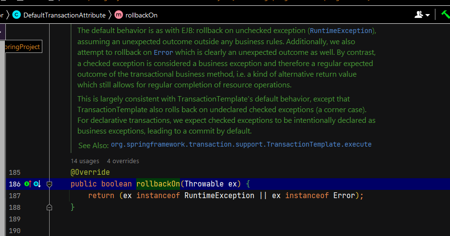

>[!WARNING]
>Проверяемые исключения не вызывают rollback если прямо не указаны в аннотационном поле rollbackFor:
>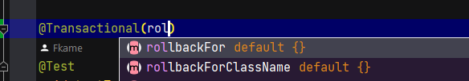

## Как отравляется состояние транзакции из-за которого она rollbackOnly?

Как видно в этом месте, мы кидаем в метод commit некий TransactionStatus.


Это класс из библиотеки spring-tx, и он расширяет ещё один важный контракт - TransactionExecution
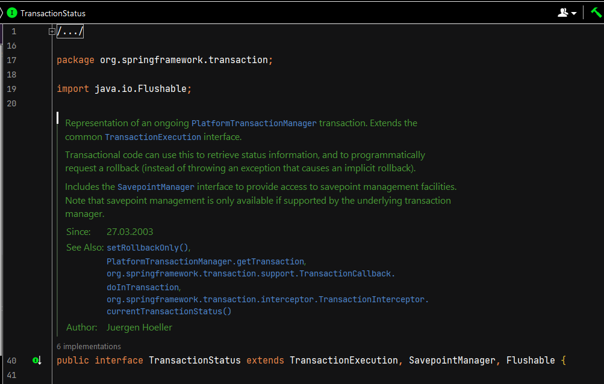

TransactionExecution хранит в себе этот флаг этот флаг, на который будет смотреть TransactionManager.
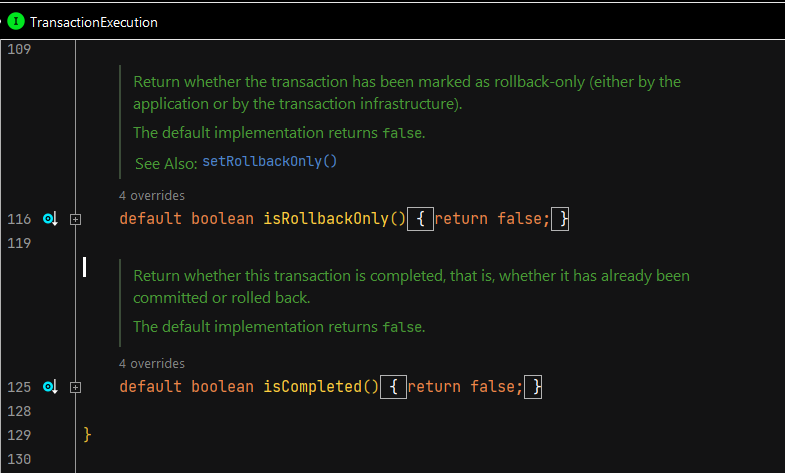

## TransactionManager

В основе всех транзакционных действий в спринге лежит TransactionManager.
Он маркерный, для нас более интересен его наследник - `PlatformTransactionManager`:
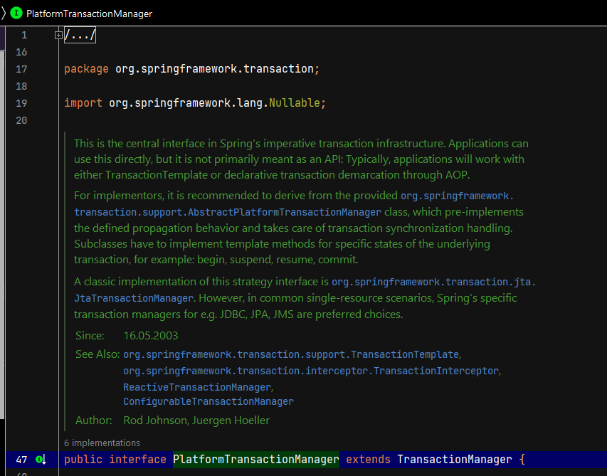

Это базовая сущность для работы с транзакциями, все другие используют имеено его. Он умеет коровые вещи:
- создать и выдать транзакцию
- сделать коммит
- сделать rollback

При коммите у него есть проверка флага rollbackOnly:
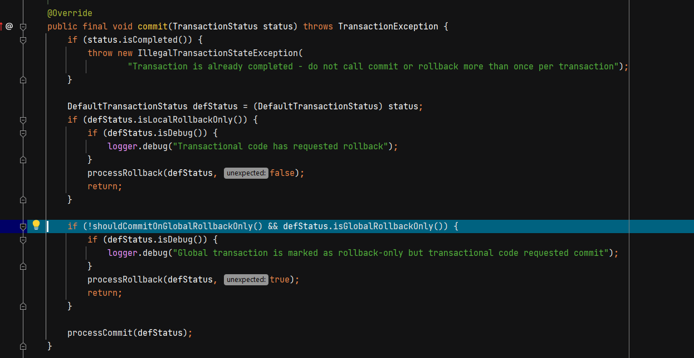

В случае обнаружения, он запускает процесс rollback с флагом неожиданности, что приведет по итогу к выбросу исключения:
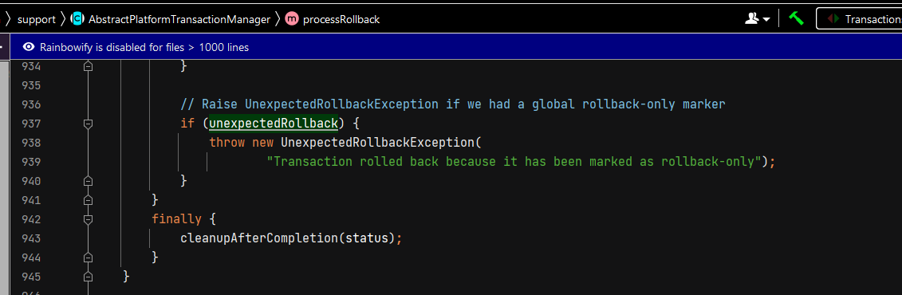

Сам коммит, конечно же, смотрит на самый JDBC-базу: получает объект коннекта, который обрабатывает текущую транзакцию и вызывает ему commit:
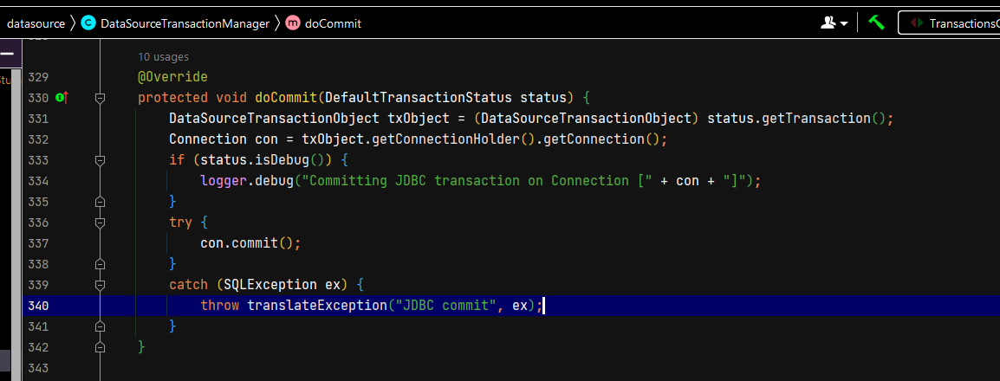

>[!INFO]
>Также у спринга есть система колбеков ДО/ПОСЛЕ коммита транзакции, бывает очень полезно
